# Component Architecture & Operational Guide

This document provides a comprehensive, file-by-file breakdown of the **Mutual Tasks PWA** architecture. Use this as the definitive guide for understanding component responsibilities, data flow, and standard patterns across the codebase.

---

## 1. Architecture Philosophy

The application follows a **Modular Feature-Based Architecture**. Logic is grouped by business domain (Features) rather than technical type (Views/Controllers), ensuring high cohesion and low coupling.

### Key Principles
- **Feature Encapsulation**: Each feature (Tasks, Projects, Auth) contains its own components, hooks, and API logic.
- **Unified Data Layer**: A centralized repository pattern (`src/db`) abstracts Supabase/Production logic from the UI.
- **Per-User State**: Most entities (like Tasks) have user-specific states managed through junction tables or status entities.
- **Type-First Development**: Centralized types in `src/types` act as the single source of truth.

---

## 2. Visual Overview

```mermaid
---
config:
  layout: fixed
---
flowchart TD
    %% ═══════════════════════════════════════════════════════════
    %% ENTRY POINT
    %% ═══════════════════════════════════════════════════════════
    EntryPoint("fa:fa-rocket main.tsx<br/>App Entry Point") --> CoreApp

    %% ═══════════════════════════════════════════════════════════
    %% CORE LAYER - src/core
    %% ═══════════════════════════════════════════════════════════
    subgraph Core["src/core - Application Shell"]
        direction TB
        CoreApp("fab:fa-react App.tsx<br/>Router + Providers")
        CoreStyles["index.css<br/>Theme Variables"]
        CoreAppStyles["App.css<br/>Global Overrides"]
        ViteEnv["vite-env.d.ts<br/>Type Defs"]
    end

    %% ═══════════════════════════════════════════════════════════
    %% LAYOUT LAYER - src/layout
    %% ═══════════════════════════════════════════════════════════
    subgraph Layout["src/layout - Navigation Shell"]
        direction LR
        AppLayout("fa:fa-columns AppLayout<br/>Page Wrapper")
        DesktopNav("fa:fa-desktop DesktopNav<br/>Sidebar")
        MobileNav("fa:fa-mobile-alt MobileNav<br/>Bottom Nav")
        Swipeable["SwipeableContainer<br/>Gesture Support"]
    end

    CoreApp --> AppLayout
    AppLayout --> DesktopNav & MobileNav
    MobileNav --> Swipeable

    %% ═══════════════════════════════════════════════════════════
    %% FEATURES LAYER - src/features
    %% ═══════════════════════════════════════════════════════════
    subgraph Features["src/features - Business Domains"]
        direction TB

        %% Pages Sub-group
        subgraph FeatPages["Pages"]
            direction LR
            IndexPage("fa:fa-home Index.tsx<br/>Today's Tasks")
            NotFoundPage("fa:fa-exclamation NotFound<br/>404 Page")
        end

        %% Auth Sub-group
        subgraph FeatAuth["Auth Feature"]
            direction TB
            AuthPage("fa:fa-lock Auth.tsx<br/>Sign In/Up UI")
            ProtectedRoute["ProtectedRoute<br/>Route Guard"]
            UseAuth["useAuth.ts<br/>Session Hook"]
            UseCurrentUser["useCurrentUser<br/>User Data Hook"]
        end

        %% Projects Sub-group
        subgraph FeatProjects["Projects Feature"]
            direction TB
            ProjectsPage("fa:fa-folder-open Projects.tsx<br/>List View")
            ProjectDetailPage("fa:fa-info-circle ProjectDetail<br/>Single View")
            
            subgraph ProjComps["Components"]
                ProjectCard["ProjectCard<br/>Preview Card"]
                ProjectForm["ProjectForm<br/>Create/Edit"]
                ProjectHeader["ProjectHeader<br/>Title Bar"]
                ProjectStats["ProjectStats<br/>Progress UI"]
                ProjectTaskSections["TaskSections<br/>Tab Lists"]
            end
            
            subgraph ProjHooks["Hooks"]
                UseProjects["useProjects<br/>Fetch/Cache"]
                UseProjectDetail["useProjectDetail<br/>Detail Logic"]
            end
            
            ProjAPI["api/projects.ts<br/>Repository"]
        end

        %% Tasks Sub-group
        subgraph FeatTasks["Tasks Feature"]
            direction TB
            subgraph TaskComps["Components"]
                TaskCard["fa:fa-check-square TaskCard<br/>Task Display"]
                TaskForm["TaskForm<br/>Create/Edit"]
                DifficultyModal["DifficultyModal<br/>Rating UI"]
            end
            
            TaskHook["hooks/useTasks<br/>Fetch/Cache"]
            TaskAPI["api/tasks.ts<br/>Repository"]
            TaskStatusAPI["api/taskStatus<br/>User Status Repo"]
        end

        %% Notifications Sub-group
        subgraph FeatNotif["Notifications"]
            direction TB
            InboxUI("fa:fa-bell Inbox.tsx<br/>Alert Center")
            NotifAPI["api/notifications<br/>Repository"]
            NotifHook["hooks/useNotif<br/>Fetch/Cache"]
        end

        %% Profile Sub-group
        subgraph FeatProfile["Profile"]
            direction TB
            ProfilePage("fa:fa-user Profile.tsx<br/>User Stats")
            StreakCal["StreakCalendar<br/>Activity Heatmap"]
        end
    end

    AppLayout --> FeatPages
    AppLayout --> FeatAuth
    AppLayout --> FeatProjects
    AppLayout --> FeatTasks
    AppLayout --> FeatNotif
    AppLayout --> FeatProfile

    %% ═══════════════════════════════════════════════════════════
    %% DATA LAYER - src/db
    %% ═══════════════════════════════════════════════════════════
    subgraph DataLayer["src/db - Supabase Abstraction"]
        direction TB
        DBIndex("fa:fa-database index.ts<br/>Client Factory")
        DBTransform["transformers.ts<br/>snake_case ↔ camelCase"]
        
        subgraph Repos["Repositories"]
            direction LR
            UsersRepo["users.ts<br/>Profile CRUD"]
            CompletionLogsRepo["completionLogs<br/>XP Tracking"]
            MagicLinksRepo["magicLinks<br/>Passwordless Auth"]
            SessionsRepo["sessions.ts<br/>Token Mgmt"]
        end
    end

    DBIndex --> DBTransform
    DBIndex --> Repos

    %% ═══════════════════════════════════════════════════════════
    %% UTILITIES LAYER - src/lib
    %% ═══════════════════════════════════════════════════════════
    subgraph Lib["src/lib - Shared Utilities"]
        direction TB
        
        subgraph LibTasks["Task Domain"]
            TaskUtils["taskUtils<br/>Status Logic"]
            TaskFilterUtils["taskFilterUtils<br/>List Filters"]
            TaskCreationUtils["taskCreationUtils<br/>Multi-User Init"]
            TaskRecoveryUtils["taskRecoveryUtils<br/>Archive Recovery"]
            TaskEmailNotif["taskEmailNotif<br/>Email Triggers"]
        end
        
        subgraph LibAuth["Auth Domain"]
            AuthLib["auth.ts<br/>Core Auth Logic"]
            AuthNextJS["auth-nextjs<br/>SSR Support"]
            SessionStorage["sessionStorage<br/>Local Persist"]
        end
        
        subgraph LibCore["Core Utils"]
            ErrorUtils["errorUtils<br/>Error Handler"]
            EnvUtils["env.ts<br/>Env Vars"]
            IdUtils["idUtils<br/>ID Generation"]
            Utils["utils.ts<br/>Misc Helpers"]
        end
        
        subgraph LibServices["Services"]
            NotifService["notificationService<br/>Alert Dispatch"]
            EmailTemplates["emailTemplates<br/>HTML Templates"]
        end
        
        ProjectUtils["projectUtils<br/>Progress Calc"]
        UserUtils["userUtils<br/>Handle Validation"]
    end

    %% ═══════════════════════════════════════════════════════════
    %% SHARED COMPONENTS - src/components
    %% ═══════════════════════════════════════════════════════════
    subgraph SharedUI["src/components - Shared UI"]
        direction LR
        NavLink["NavLink.tsx<br/>Nav Item"]
        
        subgraph ShadcnUI["ui/ - shadcn/ui Library"]
            UIButton["Button"]
            UICard["Card"]
            UIDialog["Dialog"]
            UITabs["Tabs"]
            UIToast["Toast"]
            UIMore["...40+ more"]
        end
    end

    %% ═══════════════════════════════════════════════════════════
    %% HOOKS LAYER - src/hooks
    %% ═══════════════════════════════════════════════════════════
    subgraph GlobalHooks["src/hooks - Global Hooks"]
        direction LR
        UseMobile["use-mobile<br/>Viewport"]
        UseToast["use-toast<br/>Notifications"]
        UsePWA["usePWAUpdate<br/>Service Worker"]
    end

    %% ═══════════════════════════════════════════════════════════
    %% TYPES - src/types
    %% ═══════════════════════════════════════════════════════════
    subgraph Types["src/types - Type Definitions"]
        TypesIndex["index.ts<br/>All Interfaces"]
    end

    %% ═══════════════════════════════════════════════════════════
    %% DEPENDENCY ARROWS
    %% ═══════════════════════════════════════════════════════════
    
    %% Features use Data Layer
    ProjAPI -.-> DBIndex
    TaskAPI -.-> DBIndex
    TaskStatusAPI -.-> DBIndex
    NotifAPI -.-> DBIndex
    UseAuth -.-> DBIndex

    %% Features use Utilities
    TaskCard -.-> TaskUtils
    IndexPage -.-> TaskFilterUtils
    ProjectsPage -.-> ProjectUtils
    ProfilePage -.-> ProjectUtils

    %% Features use Shared UI
    TaskCard -.-> ShadcnUI
    ProjectCard -.-> ShadcnUI
    AuthPage -.-> ShadcnUI

    %% All use Types
    DBIndex -.-> TypesIndex
    TaskUtils -.-> TypesIndex
    ProjectUtils -.-> TypesIndex

    %% ═══════════════════════════════════════════════════════════
    %% STYLING
    %% ═══════════════════════════════════════════════════════════
    style Core fill:#e3f2fd,stroke:#1565c0,stroke-width:2px
    style Layout fill:#f3e5f5,stroke:#7b1fa2,stroke-width:2px
    style Features fill:#e8f5e9,stroke:#2e7d32,stroke-width:2px
    style DataLayer fill:#fff3e0,stroke:#ef6c00,stroke-width:2px
    style Lib fill:#eceff1,stroke:#455a64,stroke-width:2px
    style SharedUI fill:#fce4ec,stroke:#c2185b,stroke-width:2px
    style GlobalHooks fill:#e0f7fa,stroke:#00838f,stroke-width:2px
    style Types fill:#f3e5f5,stroke:#6a1b9a,stroke-width:2px

    style EntryPoint color:#fff,fill:#1565c0,stroke:#0d47a1
    style CoreApp color:#000,fill:#bbdefb,stroke:#1565c0
    style DBIndex color:#000,fill:#ffe0b2,stroke:#ef6c00
    style TaskCard color:#000,fill:#c8e6c9,stroke:#2e7d32
    style AuthPage color:#000,fill:#ffcdd2,stroke:#c62828
```

---

## 3. Critical Architectural Assessment

> [!WARNING]
> **Action Required**: The following issues have been identified during a deep scan of the codebase and require attention to ensure long-term stability.

### A. Data Access Inconsistency
**Issue**: While the `db` client is the standard access point, direct imports of mock data persist in several components.
**Impact**: Bypass of the unified data layer, making future migration to real backends difficult.
**Locations**:
- `src/features/tasks/components/TaskForm.tsx`: Imports `mockUsers`, `currentUser`.
- `src/features/projects/components/ProjectForm.tsx`: Imports `mockUsers`, `currentUser`.
- `src/features/profile/components/StreakCalendar.tsx`: Imports `currentUser`.

### B. Type Safety Violations
**Issue**: Usage of `any` type defeats the purpose of TypeScript.
**Impact**: Potential runtime errors and loss of autocomplete/refactoring safety.
**Locations**:
- `src/features/tasks/components/TaskCard.tsx`: `const [project, setProject] = useState<any>(null)`
- `src/lib/auth/auth.ts`: Multiple usages of `let data: any` in API responses.

### C. Component Complexity
**Issue**: Large files mixing UI, Logic, and Data Fetching.
**Impact**: Hard to test and maintain.
**Candidates for Refactoring**:
- `src/features/auth/Auth.tsx` (~30KB): Should be split into `SignInForm`, `SignUpForm`, and `AuthLayout`.
- `src/features/projects/ProjectDetail.tsx` (~25KB): Logic should be extracted to a dedicated hook (partially done with `useProjectDetail`) and smaller sub-components.

---

## 4. Directory Breakdown

### Core Directory (`src/core`)
*The engine room of the application.*

**[main.tsx](file:///Users/abdullahalholaiel/Cursor/mutual-tasks-pwa-webapp/src/core/main.tsx)**
- **Function**: App entry point.
- **Responsibility**: Registers Global Providers and Service Workers for PWA support.

**[App.tsx](file:///Users/abdullahalholaiel/Cursor/mutual-tasks-pwa-webapp/src/core/App.tsx)**
- **Function**: Root application component.
- **Responsibility**: Handles routing (React Router) and global state providers (React Query, Toast).

**[App.css](file:///Users/abdullahalholaiel/Cursor/mutual-tasks-pwa-webapp/src/core/App.css)**
- **Function**: Global Styles.
- **Responsibility**: Component-level CSS overrides.

**[index.css](file:///Users/abdullahalholaiel/Cursor/mutual-tasks-pwa-webapp/src/core/index.css)**
- **Function**: Tailwind Entry.
- **Responsibility**: Tailwind CSS entry point and theme variable definitions (Colors, Border Radii).

### Database Layer (`src/db`)
*The data abstraction layer interfacing with Supabase.*

**[index.ts](file:///Users/abdullahalholaiel/Cursor/mutual-tasks-pwa-webapp/src/db/index.ts)**
- **Function**: Client Factory.
- **Responsibility**: Initializes repositories and handles Supabase configuration.

**[transformers.ts](file:///Users/abdullahalholaiel/Cursor/mutual-tasks-pwa-webapp/src/db/transformers.ts)**
- **Function**: Data Mapper.
- **Responsibility**: Bi-directional mapping between Database (snake_case/String IDs) and Frontend (camelCase/Number IDs) types.

**[users.ts](file:///Users/abdullahalholaiel/Cursor/mutual-tasks-pwa-webapp/src/db/users.ts)**
- **Function**: User Repository.
- **Responsibility**: User profile management and statistics.

**[completionLogs.ts](file:///Users/abdullahalholaiel/Cursor/mutual-tasks-pwa-webapp/src/db/completionLogs.ts)**
- **Function**: XP/Gamification Repository.
- **Responsibility**: Tracking task completions, XP, and difficulty ratings.

**[magicLinks.ts](file:///Users/abdullahalholaiel/Cursor/mutual-tasks-pwa-webapp/src/db/magicLinks.ts)**
- **Function**: Auth Repository.
- **Responsibility**: Handles passwordless authentication data flow.

### Feature Modules (`src/features`)
*Domain-specific logic grouped by feature.*

#### Projects Feature (`src/features/projects`)
- **[Projects.tsx](file:///Users/abdullahalholaiel/Cursor/mutual-tasks-pwa-webapp/src/features/projects/pages/Projects.tsx)**: Main list view of all projects.
- **[ProjectDetail.tsx](file:///Users/abdullahalholaiel/Cursor/mutual-tasks-pwa-webapp/src/features/projects/pages/ProjectDetail.tsx)**: Detailed single-project view.
- **Components**: `ProjectCard`, `ProjectHeader`, `ProjectStats`.
- **API**: `projects.ts` Repository for project CRUD.

#### Tasks Feature (`src/features/tasks`)
- **API**: `tasks.ts` (Core task CRUD) and `taskStatus.ts` (User-specific status management).
- **Components**:
  - `TaskCard`: Responsive card with ring indicators.
  - `TaskForm`: Creation/Edit logic.
- **Hooks**: `useTasks` for managing task lifecycle.

#### Auth Feature (`src/features/auth`)
- **[Auth.tsx](file:///Users/abdullahalholaiel/Cursor/mutual-tasks-pwa-webapp/src/features/auth/Auth.tsx)**: The unified Sign-in/Sign-up interface.
- **[ProtectedRoute.tsx](file:///Users/abdullahalholaiel/Cursor/mutual-tasks-pwa-webapp/src/features/auth/ProtectedRoute.tsx)**: HOC for guarding private routes.
- **[useAuth.ts](file:///Users/abdullahalholaiel/Cursor/mutual-tasks-pwa-webapp/src/features/auth/useAuth.ts)**: Main hook for session and login state.

### Utility Library (`src/lib`)
*Shared business logic and helper functions.*

#### Task Domain (`src/lib/tasks/`)
- **[taskUtils.ts](file:///Users/abdullahalholaiel/Cursor/mutual-tasks-pwa-webapp/src/lib/tasks/taskUtils.ts)**: Core logic for calculating per-user status colors and completion eligibility.
- **[taskFilterUtils.ts](file:///Users/abdullahalholaiel/Cursor/mutual-tasks-pwa-webapp/src/lib/tasks/taskFilterUtils.ts)**: Heavy-lifting filters for "Needs Your Action", "Upcoming", and "Archived" sections.
- **[taskCreationUtils.ts](file:///Users/abdullahalholaiel/Cursor/mutual-tasks-pwa-webapp/src/lib/tasks/taskCreationUtils.ts)**: Logic for generating multiple user statuses upon task creation.
- **[taskRecoveryUtils.ts](file:///Users/abdullahalholaiel/Cursor/mutual-tasks-pwa-webapp/src/lib/tasks/taskRecoveryUtils.ts)**: Handles recovery flow for archived/failed tasks.

#### Core Utilities
- **[errorUtils.ts](file:///Users/abdullahalholaiel/Cursor/mutual-tasks-pwa-webapp/src/lib/errorUtils.ts)**: Standardized error logging and user-facing toast notifications.
- **[env.ts](file:///Users/abdullahalholaiel/Cursor/mutual-tasks-pwa-webapp/src/lib/env.ts)**: Type-safe environment variable access.
- **[notificationService.ts](file:///Users/abdullahalholaiel/Cursor/mutual-tasks-pwa-webapp/src/lib/notifications/notificationService.ts)**: Singleton for triggering in-app and email alerts.

### Layout & UI (`src/layout`)

**[AppLayout.tsx](file:///Users/abdullahalholaiel/Cursor/mutual-tasks-pwa-webapp/src/layout/AppLayout.tsx)**
- **Function**: Layout Shell.
- **Responsibility**: The main shell wrapping all pages with sidebar/bottom nav.

**[MobileNav.tsx](file:///Users/abdullahalholaiel/Cursor/mutual-tasks-pwa-webapp/src/layout/MobileNav.tsx)**
- **Function**: Mobile Navigation.
- **Responsibility**: Responsive bottom navigation for PWA usage on mobile.

**[DesktopNav.tsx](file:///Users/abdullahalholaiel/Cursor/mutual-tasks-pwa-webapp/src/layout/DesktopNav.tsx)**
- **Function**: Desktop Sidebar.
- **Responsibility**: Slim, efficient sidebar for desktop users.

**[SwipeableContainer.tsx](file:///Users/abdullahalholaiel/Cursor/mutual-tasks-pwa-webapp/src/layout/SwipeableContainer.tsx)**
- **Function**: Gesture Handler.
- **Responsibility**: Utility for mobile-first gesture support.

---

## 5. Global Hooks (`src/hooks`)

**[use-mobile.tsx](file:///Users/abdullahalholaiel/Cursor/mutual-tasks-pwa-webapp/src/hooks/use-mobile.tsx)**
- **Function**: Responsive Hook.
- **Responsibility**: Viewport detection for responsive logic.

**[use-toast.ts](file:///Users/abdullahalholaiel/Cursor/mutual-tasks-pwa-webapp/src/hooks/use-toast.ts)**
- **Function**: UI Feedback.
- **Responsibility**: Hook for displaying temporary UI feedback.

**[usePWAUpdate.ts](file:///Users/abdullahalholaiel/Cursor/mutual-tasks-pwa-webapp/src/hooks/usePWAUpdate.ts)**
- **Function**: Service Worker Manager.
- **Responsibility**: Manages service worker updates and "New version available" prompts.

---

## 6. Operation Standardization

### Task Status
- **Rule**: Always use `calculateTaskStatusUserStatus()` from `taskUtils.ts`.
- **Reason**: Tasks do not have a global status; they have individual statuses per user.
- **Incorrect**: Checking `task.status`.

### ID Management
- **Rule**: IDs are `Numbers` in frontend and `Strings/UUIDs` in DB.
- **Action**: Always wrap DB IDs in `toNumberId()` when consuming, and `toStringId()` when sending.

### Error Handling
- **Rule**: Wrap all async operations.
- **Action**: Use `handleAsync()` helper or explicit Try/Catch with `handleError(err)`.
