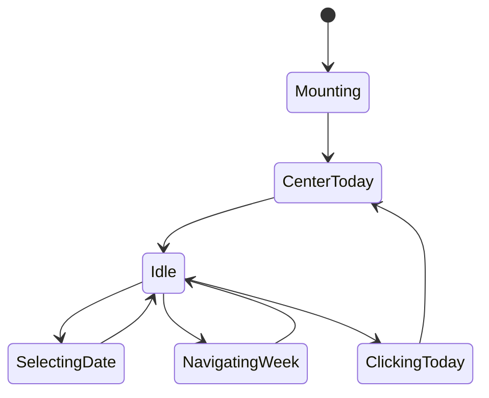

# Calendar UI Redesign - Production-Ready Implementation Plan

## Executive Summary

This document outlines a comprehensive redesign of the TaskCalendar component to address current UI/UX issues and elevate the design to production-grade standards following the frontend-design skill guidelines.

**Current Issues:**
- Day cards are too large (72px height), consuming excessive vertical space
- Today's date is not centered in the viewport
- Rectangular day picker lacks visual distinction
- Generic design lacks memorable character

**Design Goal:** Create a compact, elegant calendar interface that harmonizes with existing components while providing distinctive, premium user experience.

---

## 1. Design Philosophy

### Aesthetic Direction: "Refined Minimalist with Premium Micro-interactions"

**Core Principles:**
- **Precision over decoration**: Every pixel serves a purpose
- **Controlled density**: Maximum information in minimum space without clutter
- **Fluid motion**: Animations that feel natural, not mechanical
- **Visual hierarchy**: Clear information architecture through size, color, and spacing

**Differentiation Strategy:**
- Circular day picker with distinctive today indicator
- Subtle glow effects that respond to user interaction
- Smooth spring-based animations that feel alive
- Compact layout that prioritizes content visibility

---

## 2. Design Specifications

### 2.1 Component Structure

```
┌─────────────────────────────────────────────────────────┐
│  [←]  Month Year  [→]  [Today Button]                 │
├─────────────────────────────────────────────────────────┤
│  ○ ○ ○ ○ ○ ○ ○ (7 circular day pickers)               │
│  M T W T F S S                                         │
│  1 2 3 4 5 6 7                                         │
└─────────────────────────────────────────────────────────┘
```

### 2.2 Day Card Redesign

**Current State:**
```tsx
className="flex-1 min-h-[72px] rounded-xl flex flex-col items-center justify-center"
```

**New Specifications:**

| Property | Current | New | Rationale |
|----------|---------|-----|-----------|
| Height | 72px | 48px (mobile) / 52px (desktop) | 30% reduction for compactness |
| Shape | Rectangular (rounded-xl) | Circular (rounded-full) | Distinctive, memorable design |
| Day Letter | 10px uppercase | 9px uppercase, tracking-widest | More refined typography |
| Day Number | 24px bold | 18px bold | Proportional scaling |
| Spacing | gap-1.5 (6px) | gap-2 (8px) | Better separation for circular design |

**CSS Implementation:**
```tsx
// Base circular day picker
className={cn(
  "w-10 h-10 md:w-11 md:h-11 rounded-full flex flex-col items-center justify-center",
  "transition-all duration-300 ease-out",
  "relative overflow-hidden"
)}

// Selected state
isSelected && "bg-primary text-primary-foreground shadow-lg shadow-primary/25 scale-110"

// Today indicator (not selected)
isToday && !isSelected && "ring-2 ring-primary/30 ring-offset-2 ring-offset-background"

// Hover state
!isSelected && "hover:bg-muted/80 hover:scale-105"
```

### 2.3 Centering Logic

**Problem:** Today's date may not be visible when user navigates to different weeks.

**Solution:** Auto-scroll to center today's date when component mounts or when "Today" button is clicked.

**Implementation Strategy:**
```tsx
// Calculate center position
const centerToday = useCallback(() => {
  const todayIndex = weekDates.findIndex(date => isSameDay(date, today));
  if (todayIndex !== -1) {
    // Adjust currentDate to ensure today is in center
    const centerOffset = Math.floor(weekDates.length / 2);
    const targetDate = new Date(today);
    targetDate.setDate(today.getDate() - (todayIndex - centerOffset));
    setCurrentDate(targetDate);
  }
}, [today, weekDates]);

// Call on mount and on today button click
useEffect(() => {
  centerToday();
}, [centerToday]);
```

### 2.4 Today Button Design

**Current:** Gradient background with sun icon

**Enhanced Design:**
- Subtle pulse animation to draw attention
- Smooth spring-based press animation
- Tooltip on hover for accessibility
- Icon-only design for compactness

```tsx
<motion.button
  type="button"
  onClick={handleGoToToday}
  whileTap={{ scale: 0.92 }}
  whileHover={{ scale: 1.05 }}
  animate={{
    boxShadow: [
      "0 0 0 0 rgba(var(--primary-rgb), 0.4)",
      "0 0 0 8px rgba(var(--primary-rgb), 0)",
    ]
  }}
  transition={{
    boxShadow: { duration: 2, repeat: Infinity, ease: "easeOut" }
  }}
  className="h-8 w-8 rounded-full bg-primary text-primary-foreground flex items-center justify-center shadow-md"
  aria-label="Go to today"
>
  <CalendarIcon className="w-3.5 h-3.5" />
</motion.button>
```

### 2.5 Navigation Controls

**Enhancements:**
- Smaller, more refined buttons (32px instead of 40px)
- Circular design to match day pickers
- Subtle hover lift effect
- Disabled state for visual feedback

```tsx
<motion.button
  type="button"
  onClick={handlePrevWeek}
  disabled={isFirstWeek}
  whileTap={{ scale: 0.92 }}
  whileHover={{ scale: 1.05 }}
  animate={{
    opacity: isFirstWeek ? 0.3 : 1,
    scale: isFirstWeek ? 0.95 : 1
  }}
  className="h-8 w-8 rounded-full bg-muted/50 hover:bg-muted flex items-center justify-center transition-colors"
>
  <ChevronLeft className="w-3.5 h-3.5" />
</motion.button>
```

---

## 3. Visual Polish & Micro-interactions

### 3.1 Animation System

**Spring Physics Configuration:**
```tsx
const springConfig = {
  type: "spring" as const,
  stiffness: 400,    // Snappy but not harsh
  damping: 30,       // Slight overshoot for premium feel
  mass: 0.8          // Lightweight feel
};
```

**Staggered Entry Animation:**
```tsx
weekDates.map((date, index) => (
  <motion.button
    initial={{ opacity: 0, scale: 0.8, y: 10 }}
    animate={{ opacity: 1, scale: 1, y: 0 }}
    transition={{
      ...springConfig,
      delay: 0.5 + (index * 0.04)  // 40ms stagger
    }}
  >
```

### 3.2 Selection State Transitions

**Selected Day Animation:**
- Scale up to 110% with spring
- Add glow shadow that pulses
- Gradient overlay for depth

```tsx
{isSelected && (
  <>
    <motion.div
      initial={{ scale: 0 }}
      animate={{ scale: 1 }}
      transition={springConfig}
      className="absolute inset-0 bg-gradient-to-br from-white/20 to-transparent"
    />
    <motion.div
      animate={{
        boxShadow: [
          "0 0 20px -5px rgba(var(--primary-rgb), 0.3)",
          "0 0 30px -5px rgba(var(--primary-rgb), 0.5)",
          "0 0 20px -5px rgba(var(--primary-rgb), 0.3)"
        ]
      }}
      transition={{ duration: 2, repeat: Infinity, ease: "easeInOut" }}
      className="absolute inset-0 rounded-full"
    />
  </>
)}
```

### 3.3 Today Indicator

**Distinctive Design:**
- Ring indicator for today (when not selected)
- Small dot below the date number
- Subtle glow effect

```tsx
{isToday && !isSelected && (
  <>
    <motion.div
      initial={{ scale: 0 }}
      animate={{ scale: 1 }}
      className="absolute inset-0 rounded-full ring-2 ring-primary/30 ring-offset-2 ring-offset-background"
    />
    <motion.div
      animate={{
        scale: [1, 1.2, 1],
        opacity: [0.5, 1, 0.5]
      }}
      transition={{ duration: 2, repeat: Infinity }}
      className="absolute -bottom-1 left-1/2 -translate-x-1/2 w-1 h-1 bg-primary rounded-full"
    />
  </>
)}
```

---

## 4. Responsive Design

### 4.1 Breakpoints

| Screen Size | Day Picker Size | Gap | Font Sizes |
|-------------|----------------|-----|------------|
| Mobile (< 640px) | 40px | 8px | Day: 9px, Number: 18px |
| Tablet (640px+) | 44px | 8px | Day: 10px, Number: 20px |
| Desktop (768px+) | 44px | 8px | Day: 10px, Number: 20px |

### 4.2 Container Width

```tsx
className="max-w-[360px] md:max-w-[400px] mx-auto"
```

### 4.3 Touch Optimization

- Minimum touch target: 44x44px (WCAG AA)
- Reduced motion support for accessibility
- Haptic feedback on selection (mobile)

---

## 5. Accessibility Considerations

### 5.1 Keyboard Navigation

```tsx
// Tab order: Prev button → Day pickers → Next button → Today button
tabIndex={0}
onKeyDown={(e) => {
  if (e.key === 'Enter' || e.key === ' ') {
    e.preventDefault();
    handleDateChange(date);
  }
}}
```

### 5.2 Screen Reader Support

```tsx
aria-label={`${dayLetter} ${dayNumber}${isToday ? ', today' : ''}${isSelected ? ', selected' : ''}`}
aria-pressed={isSelected}
role="button"
```

### 5.3 Reduced Motion

```tsx
prefersReducedMotion = usePrefersReducedMotion();

transition={prefersReducedMotion ? "none" : springConfig}
```

---

## 6. Performance Optimization

### 6.1 Render Optimization

- Use `useMemo` for date calculations
- Avoid inline function creation in render
- Implement virtual scrolling for long date ranges (future consideration)

### 6.2 Animation Performance

- Use `transform` and `opacity` only (GPU-accelerated)
- Avoid animating `height`, `width`, `top`, `left`
- Use `will-change` sparingly

```tsx
style={{
  transform: 'translateZ(0)',  // Force GPU acceleration
  willChange: 'transform, opacity'
}}
```

### 6.3 Bundle Size

- No new dependencies (use existing framer-motion)
- Tree-shake unused animations
- Lazy load component if needed

---

## 7. Integration Requirements

### 7.1 Existing Functionality Preservation

- Date filtering logic must remain unchanged
- `onDateChange` callback signature preserved
- `selectedDate` prop handling maintained
- Today button functionality retained

### 7.2 Component API

```tsx
interface TaskCalendarProps {
  onDateChange?: (date: Date | undefined) => void;
  selectedDate?: Date | undefined;
}
```

**No breaking changes to existing API.**

### 7.3 State Management

```tsx
// Internal state for calendar navigation
const [internalDate, setInternalDate] = useState<Date | undefined>(externalSelectedDate);
const [currentDate, setCurrentDate] = useState<Date>(new Date());

// Controlled/uncontrolled pattern preserved
const selectedDate = externalSelectedDate ?? internalDate;
```

---

## 8. Testing Strategy

### 8.1 Unit Tests

- [ ] Centering logic for today's date
- [ ] Date navigation (prev/next week)
- [ ] Selection state management
- [ ] Today button functionality

### 8.2 Integration Tests

- [ ] Date filtering in parent component
- [ ] Responsive behavior across breakpoints
- [ ] Keyboard navigation flow

### 8.3 Visual Regression Tests

- [ ] Screenshots for each state (default, selected, today, hover)
- [ ] Cross-browser consistency
- [ ] Dark/light mode variants

### 8.4 Accessibility Tests

- [ ] Keyboard navigation
- [ ] Screen reader announcements
- [ ] Focus management
- [ ] Color contrast ratios (WCAG AA)

---

## 9. Implementation Phases

### Phase 1: Core Structure (Priority: High)
- Redesign day cards to circular shape
- Reduce height to 48-52px
- Update typography and spacing

### Phase 2: Centering Logic (Priority: High)
- Implement auto-center today on mount
- Add scroll-to-today on button click
- Test edge cases (month boundaries)

### Phase 3: Visual Polish (Priority: Medium)
- Add spring animations
- Implement selection state transitions
- Create today indicator with glow

### Phase 4: Responsive & Accessibility (Priority: Medium)
- Implement responsive breakpoints
- Add keyboard navigation
- Screen reader support

### Phase 5: Performance & Testing (Priority: Low)
- Performance optimization
- Cross-browser testing
- Accessibility audit

---

## 10. Success Criteria

### 10.1 Metrics

- **Vertical space reduction**: 30% (72px → 50px)
- **Animation performance**: 60fps on all devices
- **Touch target compliance**: 100% (44x44px minimum)
- **Accessibility score**: 95+ (Lighthouse)
- **Visual consistency**: Matches TaskStatCard design language

### 10.2 User Experience Goals

- Instant recognition of today's date
- Smooth, predictable animations
- Clear visual hierarchy
- Delightful micro-interactions
- Compact without feeling cramped

### 10.3 Production Readiness Checklist

- [ ] No console errors or warnings
- [ ] All animations complete smoothly
- [ ] Responsive on all device sizes
- [ ] Keyboard navigation works end-to-end
- [ ] Screen reader announces all states
- [ ] Touch interactions feel native
- [ ] Performance budget met (< 16ms per frame)
- [ ] Cross-browser tested (Chrome, Safari, Firefox)
- [ ] Dark/light mode both look polished
- [ ] Design system consistency maintained

---

## 11. Design System Alignment

### 11.1 Color Usage

- **Primary**: Selection state, today indicator
- **Muted**: Unselected days, navigation buttons
- **Accent**: Hover states
- **Foreground**: Day numbers, labels
- **Muted-foreground**: Day letters, secondary text

### 11.2 Typography

- **Font**: Satoshi (already in use)
- **Day letters**: Uppercase, tracking-widest, 9-10px
- **Day numbers**: Bold, 18-20px
- **Month label**: Semibold, 14px

### 11.3 Spacing System

- **Container padding**: 12px (p-3)
- **Day gap**: 8px (gap-2)
- **Navigation spacing**: 8px between buttons
- **Vertical rhythm**: 4px base unit

### 11.4 Animation Patterns

- **Spring physics**: Stiffness 400, Damping 30
- **Duration**: 200-300ms for transitions
- **Stagger**: 40ms between sequential elements
- **Easing**: Custom spring, not linear

---

## 12. Future Enhancements (Out of Scope)

- Swipe gestures for week navigation
- Long-press for quick actions
- Month view toggle
- Task count indicators on dates
- Custom date ranges
- Drag-and-drop date selection

---

## Appendix A: Code Comparison

### Before (Current TaskCalendar.tsx)

```tsx
<motion.button
  className={cn(
    "flex-1 min-h-[72px] rounded-xl flex flex-col items-center justify-center",
    isSelected
      ? "bg-primary text-primary-foreground shadow-lg shadow-primary/30"
      : isToday
      ? "bg-accent/50 text-accent-foreground ring-2 ring-primary/20"
      : "bg-muted/30 text-muted-foreground hover:bg-muted/60"
  )}
>
  <span className="text-[10px] font-semibold uppercase tracking-wider mb-1">
    {dayLetter}
  </span>
  <span className="text-2xl font-bold">
    {dayNumber}
  </span>
</motion.button>
```

### After (Proposed Design)

```tsx
<motion.button
  className={cn(
    "w-10 h-10 md:w-11 md:h-11 rounded-full flex flex-col items-center justify-center",
    "transition-all duration-300 ease-out relative overflow-hidden",
    isSelected
      ? "bg-primary text-primary-foreground shadow-lg shadow-primary/25 scale-110"
      : isToday
      ? "ring-2 ring-primary/30 ring-offset-2 ring-offset-background hover:bg-muted/80"
      : "hover:bg-muted/80 hover:scale-105"
  )}
>
  <span className="text-[9px] md:text-[10px] font-semibold uppercase tracking-widest">
    {dayLetter}
  </span>
  <span className="text-[18px] md:text-[20px] font-bold">
    {dayNumber}
  </span>
  {isToday && !isSelected && (
    <motion.div
      animate={{ scale: [1, 1.2, 1], opacity: [0.5, 1, 0.5] }}
      transition={{ duration: 2, repeat: Infinity }}
      className="absolute -bottom-1 left-1/2 -translate-x-1/2 w-1 h-1 bg-primary rounded-full"
    />
  )}
</motion.button>
```

---

## Appendix B: Mermaid Diagrams

### Component State Flow



### Animation Timeline

```mermaid
gantt
    title Calendar Entry Animation Sequence
    dateFormat X
    axisFormat %Lms

    section Component
    Container Fade In      :a1, 0, 300
    Navigation Buttons     :a2, 100, 300
    Month Label            :a3, 150, 200

    section Day Pickers
    Day 1                  :d1, 500, 200
    Day 2                  :d2, 540, 200
    Day 3                  :d3, 580, 200
    Day 4                  :d4, 620, 200
    Day 5                  :d5, 660, 200
    Day 6                  :d6, 700, 200
    Day 7                  :d7, 740, 200

    section Today Indicator
    Pulse Animation        :p1, 760, 2000
```



---

**Document Version:** 1.0
**Last Updated:** 2026-02-10
**Status:** Ready for Implementation
