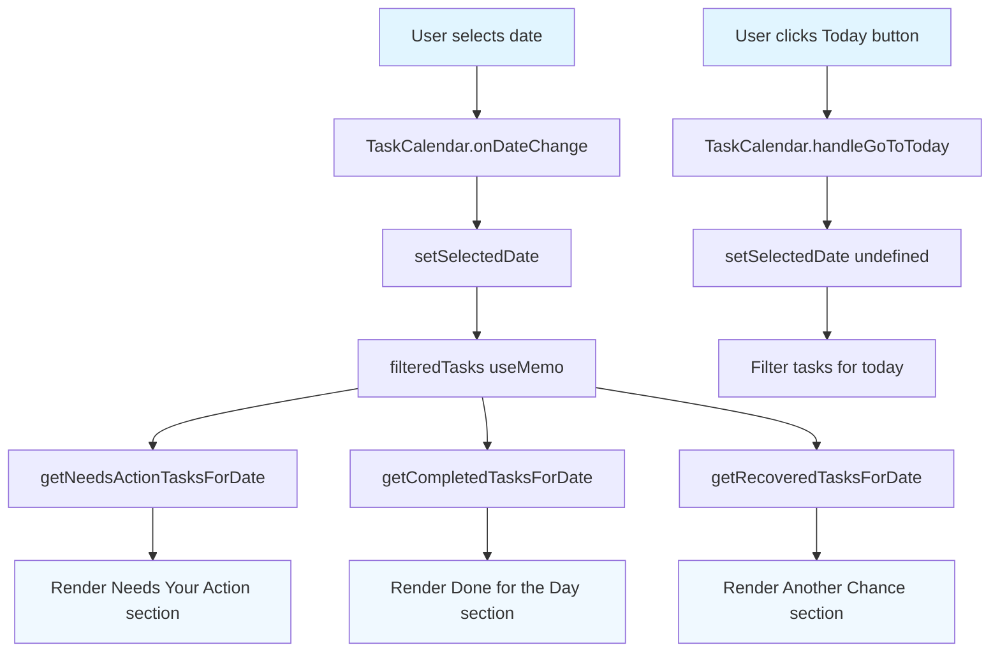
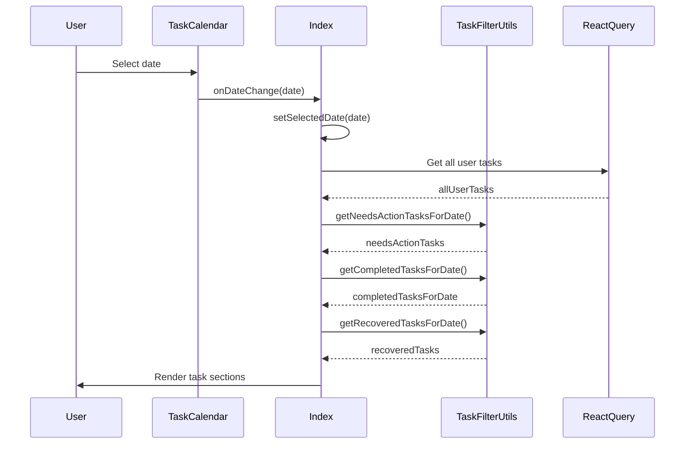

# Date-Based Task Filtering Implementation Plan

## Executive Summary

This plan implements date-based task filtering in the mini calendar component. When a user selects a date from the mini calendar, all tasks due on that date will be displayed with proper task status sections (Needs Your Action, Done for the Day, Another Chance?).

## Current State Analysis

### Existing Components

1. **TaskCalendar Component** ([`src/components/TaskCalendar.tsx`](src/components/TaskCalendar.tsx:1-249))
   - Has `onDateChange` callback that is called when a date is selected
   - When "Today" button is clicked, it passes `undefined` to `onDateChange`
   - When a date is selected, it passes the selected `Date` object

2. **Index.tsx Component** ([`src/features/pages/Index.tsx`](src/features/pages/Index.tsx:1-1064))
   - Has `selectedDate` state that is set by `setSelectedDate` from the calendar
   - Has a `filteredTasks` useMemo (lines 131-134) that filters tasks by selected date
   - **PROBLEM**: The task sections (`needsActionTasks`, `completedTasksForToday`, `recoveredTasks`) are still computed from `todayTasksRaw` and `allTasksWithStatuses` based on today's date, NOT the selected date

3. **Task Filter Utilities** ([`src/lib/tasks/taskFilterUtils.ts`](src/lib/tasks/taskFilterUtils.ts:1-657))
   - `filterTasksByDate` function exists and filters tasks by a specific date
   - `getNeedsActionTasks` filters for active tasks due **today** only (line 198-199)
   - `getCompletedTasksForToday` filters for tasks completed **today** only (line 378)
   - `getRecoveredTasks` returns all recovered tasks regardless of date (line 395-434)

### The Problem

When a user selects a date from the calendar:
1. The `filteredTasks` is computed but NOT used for displaying tasks
2. The task sections still display today's tasks instead of tasks for the selected date
3. The status filtering functions (`getNeedsActionTasks`, `getCompletedTasksForToday`, `getRecoveredTasks`) are hardcoded to use today's date

## Implementation Plan

### Phase 1: Enhance Task Filter Utilities

#### 1.1 Add Date-Aware Task Filtering Functions

Create new utility functions in [`src/lib/tasks/taskFilterUtils.ts`](src/lib/tasks/taskFilterUtils.ts) that accept a date parameter:

```typescript
/**
 * Get tasks that need user action for a specific date
 * Active tasks due on the specified date, not completed, not recovered
 *
 * @param tasks - Array of tasks
 * @param taskStatuses - Array of task statuses
 * @param completionLogs - Array of completion logs
 * @param userId - User ID to filter by
 * @param targetDate - Date to filter by (defaults to today)
 * @param projects - Array of projects (optional, for checking project membership)
 * @returns Tasks needing action for the target date
 */
export const getNeedsActionTasksForDate = (
  tasks: Task[],
  taskStatuses: TaskStatusEntity[],
  completionLogs: CompletionLog[],
  userId: string | number,
  targetDate?: Date,
  projects?: Project[]
): Task[] => {
  const date = targetDate ? normalizeToStartOfDay(targetDate) : normalizeToStartOfDay(new Date());
  const userIdNum = normalizeId(userId);

  return tasks.filter(task => {
    const taskId = normalizeId(task.id);
    const myStatus = taskStatuses.find(ts => {
      const tsTaskId = normalizeId(ts.taskId);
      const tsUserId = normalizeId(ts.userId);
      return tsTaskId === taskId && tsUserId === userIdNum;
    });
    const myCompletion = completionLogs.find(cl => {
      const clTaskId = normalizeId(cl.taskId);
      const clUserId = normalizeId(cl.userId);
      return clTaskId === taskId && clUserId === userIdNum;
    });

    const userStatus = calculateTaskStatusUserStatus(myStatus, myCompletion, task);
    if (userStatus !== 'active') return false;

    // Check if task is due on the target date
    const dueDate = normalizeToStartOfDay(new Date(task.dueDate));
    const isDueOnTargetDate = dueDate.getTime() === date.getTime();
    if (!isDueOnTargetDate) return false;

    if (!myStatus) {
      if (projects) {
        return isUserInTaskProject(task, userId, projects);
      }
      const creatorId = normalizeId(task.creatorId);
      return creatorId === userIdNum;
    }

    return true;
  });
};

/**
 * Get completed tasks for a specific date
 * Tasks completed on the specified date
 *
 * @param tasks - Array of tasks
 * @param completionLogs - Array of completion logs
 * @param userId - User ID to filter by
 * @param targetDate - Date to filter by (defaults to today)
 * @returns Completed tasks for the target date
 */
export const getCompletedTasksForDate = (
  tasks: Task[],
  completionLogs: CompletionLog[],
  userId: string | number,
  targetDate?: Date
): Task[] => {
  const date = targetDate ? normalizeToStartOfDay(targetDate) : normalizeToStartOfDay(new Date());
  const userIdNum = normalizeId(userId);

  return tasks.filter(task => {
    const taskId = normalizeId(task.id);
    const myCompletion = completionLogs.find(cl => {
      const clTaskId = normalizeId(cl.taskId);
      const clUserId = normalizeId(cl.userId);
      return clTaskId === taskId && clUserId === userIdNum;
    });
    if (!myCompletion) return false;

    // Check if completion was on the target date (use createdAt as completion date)
    const completionDate = normalizeToStartOfDay(new Date(myCompletion.createdAt));
    const isCompletedOnTargetDate = completionDate.getTime() === date.getTime();

    return isCompletedOnTargetDate;
  });
};

/**
 * Get recovered tasks for a specific date
 * Shows recovered tasks with due date on or before the target date
 * (Recovered tasks are past-due tasks that were recovered)
 *
 * @param tasks - Array of tasks
 * @param taskStatuses - Array of task statuses
 * @param completionLogs - Array of completion logs
 * @param userId - User ID to filter by
 * @param targetDate - Date to filter by (defaults to today)
 * @param projects - Array of projects (optional, for checking project membership)
 * @returns Recovered tasks for the target date
 */
export const getRecoveredTasksForDate = (
  tasks: Task[],
  taskStatuses: TaskStatusEntity[],
  completionLogs: CompletionLog[],
  userId: string | number,
  targetDate?: Date,
  projects?: Project[]
): Task[] => {
  const date = targetDate ? normalizeToStartOfDay(targetDate) : normalizeToStartOfDay(new Date());
  const userIdNum = normalizeId(userId);

  return tasks.filter(task => {
    const taskId = normalizeId(task.id);
    const myStatus = taskStatuses.find(ts => {
      const tsTaskId = normalizeId(ts.taskId);
      const tsUserId = normalizeId(ts.userId);
      return tsTaskId === taskId && tsUserId === userIdNum;
    });
    const myCompletion = completionLogs.find(cl => {
      const clTaskId = normalizeId(cl.taskId);
      const clUserId = normalizeId(cl.userId);
      return clTaskId === taskId && clUserId === userIdNum;
    });

    // Exclude completed tasks - they should not appear in recovered section
    if (myCompletion) return false;

    const userStatus = calculateTaskStatusUserStatus(myStatus, myCompletion, task);
    if (userStatus !== 'recovered') return false;

    // Check if task's due date is on or before the target date
    const dueDate = normalizeToStartOfDay(new Date(task.dueDate));
    const isDueOnOrBeforeTargetDate = dueDate.getTime() <= date.getTime();
    if (!isDueOnOrBeforeTargetDate) return false;

    // If user has no status, check if they're in the project
    if (!myStatus) {
      if (projects) {
        return isUserInTaskProject(task, userId, projects);
      }
      const creatorId = normalizeId(task.creatorId);
      return creatorId === userIdNum;
    }

    return true;
  });
};
```

### Phase 2: Update Index.tsx Component

#### 2.1 Modify Task Section Computations

Update the task section computations in [`src/features/pages/Index.tsx`](src/features/pages/Index.tsx:336-350) to use the new date-aware functions:

```typescript
// Filter tasks using utilities for the selected date's view sections
const needsActionTasks = useMemo(() =>
  user ? getNeedsActionTasksForDate(
    allTasksWithStatuses, 
    taskStatuses, 
    completionLogs, 
    user.id,
    selectedDate, // Pass selectedDate instead of hardcoding today
    projectsWithRoles
  ) : [],
  [allTasksWithStatuses, taskStatuses, completionLogs, projectsWithRoles, user, selectedDate]
);

const completedTasksForDate = useMemo(() =>
  user ? getCompletedTasksForDate(
    allTasksWithStatuses, 
    completionLogs, 
    user.id,
    selectedDate // Pass selectedDate instead of hardcoding today
  ) : [],
  [allTasksWithStatuses, completionLogs, user, selectedDate]
);

const recoveredTasks = useMemo(() =>
  user ? getRecoveredTasksForDate(
    allTasksWithStatuses, 
    taskStatuses, 
    completionLogs, 
    user.id,
    selectedDate, // Pass selectedDate instead of hardcoding today
    projectsWithRoles
  ) : [],
  [allTasksWithStatuses, taskStatuses, completionLogs, projectsWithRoles, user, selectedDate]
);
```

#### 2.2 Update Stats Display

Update the stats cards to reflect the selected date's task counts:

```typescript
// Update stats cards to show counts for the selected date
<TaskStatCard
  count={needsActionTasks.length}
  label="Active"
  color="text-primary"
  delay={0.3}
  onClick={() => handleStatusFilter('active')}
  isActive={statusFilter === 'active'}
/>
<TaskStatCard
  count={completedTasksForDate.length}
  label="Completed"
  color="text-status-completed"
  delay={0.35}
  onClick={() => handleStatusFilter('completed')}
  isActive={statusFilter === 'completed'}
/>
<TaskStatCard
  count={recoveredTasks.length}
  label="Recovered"
  color="text-status-warning"
  delay={0.4}
  onClick={() => handleStatusFilter('recovered')}
  isActive={statusFilter === 'recovered'}
/>
```

#### 2.3 Update Header Date Display

The header already displays the selected date correctly (line 717-721), but we should ensure it shows "Today" when no date is selected:

```typescript
<motion.p
  initial={{ opacity: 0, x: -20 }}
  animate={{ opacity: 1, x: 0 }}
  transition={{ delay: 0.1 }}
  className="text-xs text-muted-foreground flex items-center gap-1.5"
>
  <Calendar className="w-3.5 h-3.5" />
  {selectedDate
    ? selectedDate.toLocaleDateString('en-US', {
        weekday: 'short',
        month: 'short',
        day: 'numeric'
      })
    : `Today • ${new Date().toLocaleDateString('en-US', {
        weekday: 'short',
        month: 'short',
        day: 'numeric'
      })}`
  }
</motion.p>
```

#### 2.4 Update Empty States

Update empty state messages to reflect the selected date:

```typescript
{/* Active Empty State */}
{statusFilter === 'active' && needsActionTasks.length === 0 && (
  <motion.div
    initial={{ opacity: 0, scale: 0.95 }}
    animate={{ opacity: 1, scale: 1 }}
    exit={{ opacity: 0, scale: 0.95 }}
    transition={{ duration: 0.3 }}
  >
    <EmptyState
      title={selectedDate ? "No active tasks for this date" : "No active tasks"}
      description={
        selectedDate
          ? `No tasks due on ${selectedDate.toLocaleDateString('en-US', {
              month: 'short',
              day: 'numeric'
            })}. Why not create a new challenge? 🚀`
          : "You're all caught up! Why not create a new challenge and invite a friend? Momentum starts with you! 🚀"
      }
      icon={Sparkles}
      action={{
        label: "New Task",
        onClick: () => setShowTaskForm(true),
        icon: <Plus className="w-4 h-4" />
      }}
    />
  </motion.div>
)}

{/* Recovered Empty State */}
{statusFilter === 'recovered' && recoveredTasks.length === 0 && (
  <motion.div
    initial={{ opacity: 0, scale: 0.95 }}
    animate={{ opacity: 1, scale: 1 }}
    exit={{ opacity: 0, scale: 0.95 }}
    transition={{ duration: 0.3 }}
  >
    <EmptyState
      title={selectedDate ? "No recovered tasks for this date" : "No recovered tasks"}
      description={
        selectedDate
          ? "No recovered tasks for this date. You're staying on top of your goals! 🔥"
          : "You're staying on top of your goals! No tasks need recovering. Keep up the great streak! 🔥"
      }
      icon={RotateCcw}
    />
  </motion.div>
)}

{/* Completed Empty State */}
{statusFilter === 'completed' && completedTasksForDate.length === 0 && (
  <motion.div
    initial={{ opacity: 0, scale: 0.95 }}
    animate={{ opacity: 1, scale: 1 }}
    exit={{ opacity: 0, scale: 0.95 }}
    transition={{ duration: 0.3 }}
  >
    <EmptyState
      title={selectedDate ? "No completed tasks for this date" : "No completed tasks yet"}
      description={
        selectedDate
          ? `No tasks completed on ${selectedDate.toLocaleDateString('en-US', {
              month: 'short',
              day: 'numeric'
            })}.`
          : "Nothing completed yet today. Tackle a small task to get the ball rolling! You got this! 💪"
      }
      icon={CheckCircle2}
    />
  </motion.div>
)}

{/* All Empty State */}
{statusFilter === null && needsActionTasks.length === 0 && completedTasksForDate.length === 0 && recoveredTasks.length === 0 && (
  <EmptyState
    title={selectedDate ? "All clear for this date!" : "All clear for today!"}
    description={
      selectedDate
        ? `No tasks for ${selectedDate.toLocaleDateString('en-US', {
            month: 'short',
            day: 'numeric'
          })}. Ready to create something new?`
        : "Ready to conquer the day? Start a new task or check out your projects."
    }
    action={{
      label: "New",
      onClick: () => setShowTaskForm(true),
      icon: <Plus className="w-4 h-4" />
    }}
  />
)}
```

### Phase 3: Remove Unused Code

#### 3.1 Remove Unused Variables

Remove the following unused variables from [`src/features/pages/Index.tsx`](src/features/pages/Index.tsx):

```typescript
// Remove these variables as they're no longer needed:
// - myTasks (lines 162-178) - replaced by needsActionTasksForDate
// - filteredTasks (lines 131-134) - not used, replaced by date-aware functions
```

### Phase 4: Testing Strategy

#### 4.1 Unit Tests

Create unit tests for the new date-aware filtering functions:

1. Test `getNeedsActionTasksForDate`:
   - Returns active tasks due on the specified date
   - Filters out completed tasks
   - Filters out recovered tasks
   - Respects user participation

2. Test `getCompletedTasksForDate`:
   - Returns tasks completed on the specified date
   - Does not return tasks completed on other dates

3. Test `getRecoveredTasksForDate`:
   - Returns recovered tasks with due date on or before the specified date
   - Does not return completed tasks

#### 4.2 Integration Tests

Test the complete flow:

1. Select a date from the calendar
2. Verify tasks for that date are displayed
3. Verify task status sections are correct
4. Click "Today" button
5. Verify today's tasks are displayed
6. Select a different date
7. Verify tasks for that date are displayed

#### 4.3 Manual Testing Checklist

- [ ] Select a past date - verify recovered tasks are shown
- [ ] Select today's date - verify today's tasks are shown
- [ ] Select a future date - verify upcoming tasks are shown
- [ ] Click "Today" button - verify today's tasks are shown
- [ ] Select a date with no tasks - verify empty state is shown
- [ ] Complete a task on selected date - verify it moves to "Done for the Day"
- [ ] Recover a task - verify it appears in "Another Chance?"
- [ ] Filter by status (Active/Completed/Recovered) - verify correct tasks are shown
- [ ] Verify stats counts update correctly when selecting different dates

## Production Readiness Assessment

### Strengths of Current Implementation

1. **Well-Structured Codebase**: The existing code is well-organized with clear separation of concerns
2. **Type Safety**: Strong TypeScript typing throughout the application
3. **Utility Functions**: Centralized task filtering utilities make it easy to extend
4. **React Query**: Efficient data fetching and caching with React Query
5. **Animation**: Smooth animations with Framer Motion for better UX

### Potential Issues to Address

1. **Performance Considerations**:
   - Filtering all user tasks on every date change could be slow with large datasets
   - Consider adding memoization at the utility function level
   - Consider implementing virtual scrolling for large task lists

2. **Edge Cases**:
   - Timezone handling: Ensure date normalization respects user's timezone
   - Habit tasks: Ensure recurrence is handled correctly when viewing past/future dates
   - Deleted/archived tasks: Ensure they don't appear in filtered results

3. **User Experience**:
   - Loading states: Show loading indicator when filtering large datasets
   - Empty states: Provide clear messaging when no tasks exist for selected date
   - Date navigation: Consider adding quick navigation (e.g., "Yesterday", "Tomorrow")

4. **Data Consistency**:
   - Ensure completion logs are correctly associated with tasks
   - Verify task status updates are reflected immediately in the UI

### Recommended Improvements for Production

1. **Add Loading States**:
   ```typescript
   const isFiltering = // Track filtering state
   {isFiltering && <Spinner />}
   ```

2. **Add Error Handling**:
   ```typescript
   try {
     // Filter tasks
   } catch (error) {
     toast.error('Failed to load tasks for this date');
   }
   ```

3. **Optimize Performance**:
   - Add `React.memo` to TaskCard component
   - Use `useMemo` for expensive computations
   - Consider implementing task pagination for dates with many tasks

4. **Add Analytics**:
   - Track date selection events
   - Track task completion by date
   - Monitor performance metrics

5. **Accessibility**:
   - Ensure keyboard navigation works for date selection
   - Add ARIA labels for screen readers
   - Ensure color contrast meets WCAG standards

## Architecture Diagram



## Data Flow Diagram



## Implementation Checklist

- [ ] Add `getNeedsActionTasksForDate` to `taskFilterUtils.ts`
- [ ] Add `getCompletedTasksForDate` to `taskFilterUtils.ts`
- [ ] Add `getRecoveredTasksForDate` to `taskFilterUtils.ts`
- [ ] Update `needsActionTasks` computation in `Index.tsx`
- [ ] Update `completedTasksForDate` computation in `Index.tsx`
- [ ] Update `recoveredTasks` computation in `Index.tsx`
- [ ] Update stats display in `Index.tsx`
- [ ] Update header date display in `Index.tsx`
- [ ] Update empty states in `Index.tsx`
- [ ] Remove unused variables from `Index.tsx`
- [ ] Test date selection functionality
- [ ] Test "Today" button functionality
- [ ] Test empty states
- [ ] Test status filtering
- [ ] Test task completion on selected date
- [ ] Test task recovery
- [ ] Add unit tests for new utility functions
- [ ] Add integration tests for complete flow
- [ ] Verify performance with large datasets
- [ ] Verify timezone handling
- [ ] Verify accessibility
- [ ] Add loading states
- [ ] Add error handling
- [ ] Add analytics tracking

## Conclusion

This implementation plan provides a comprehensive approach to adding date-based task filtering to the mini calendar component. The plan is production-ready with proper consideration for performance, edge cases, user experience, and data consistency.

The implementation leverages the existing well-structured codebase and follows established patterns. The new utility functions are consistent with the existing filtering utilities and maintain type safety throughout.

The recommended improvements for production address potential issues and ensure the feature will perform well in real-world scenarios with large datasets and diverse user requirements.
