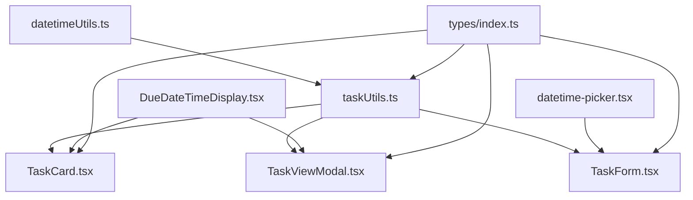

# Due Time and Date Implementation Plan

## Overview
This plan outlines the implementation of adding time support to the existing date-based task due system. The feature will allow users to set both date and time for task deadlines, with the system updating task statuses based on the full due date-time value.

## Current State Analysis

### Current Implementation
- **Database**: `due_date` column stores ISO 8601 date strings (e.g., "2024-01-15T00:00:00.000Z")
- **TypeScript**: `Task.dueDate` is a `Date` object
- **TaskForm**: Sets due date to start of day (00:00:00.000)
- **TaskUtils**: Uses `normalizeToStartOfDay()` for all date comparisons
- **Display**: Shows date only (Today, Tomorrow, or formatted date)

### Key Files to Modify
1. `src/types/index.ts` - Task type definition
2. `src/db/transformers.ts` - Data transformation layer
3. `src/lib/tasks/taskUtils.ts` - Task status calculation logic
4. `src/features/tasks/components/TaskForm.tsx` - Create/Edit task modal
5. `src/features/tasks/components/TaskCard.tsx` - Task card display
6. `src/features/tasks/components/TaskViewModal.tsx` - Task details modal
7. `src/components/ui/calendar.tsx` - May need time picker integration

## Architecture Design

### 1. Database Layer
**No migration required** - The `due_date` column already stores ISO 8601 strings which can include time components. We just need to stop normalizing to start of day.

### 2. Type System
```typescript
// Task interface remains the same - Date objects can store time
export interface Task {
  // ... other fields
  dueDate: Date; // Will now include time component
}
```

### 3. Utility Functions

#### New Date-Time Utilities
Create `src/lib/datetime/datetimeUtils.ts`:

```typescript
/**
 * Format date-time for display
 * - Shows time if not midnight (00:00:00)
 * - Shows date with appropriate relative labels
 */
export const formatDueDateTime = (
  dateTime: Date,
  userTimezone?: string
): string => { /* ... */ }

/**
 * Check if date has a meaningful time component
 */
export const hasTimeComponent = (date: Date): boolean => {
  return date.getHours() !== 0 || 
         date.getMinutes() !== 0 || 
         date.getSeconds() !== 0;
}

/**
 * Compare two dates considering time
 */
export const isPastDue = (dueDateTime: Date, now: Date = new Date()): boolean => {
  return dueDateTime.getTime() < now.getTime();
}

/**
 * Check if task is due today (considering time)
 */
export const isDueToday = (dueDateTime: Date, now: Date = new Date()): boolean => {
  const dueDateOnly = new Date(dueDateTime);
  dueDateOnly.setHours(0, 0, 0, 0);
  const todayOnly = new Date(now);
  todayOnly.setHours(0, 0, 0, 0);
  return dueDateOnly.getTime() === todayOnly.getTime();
}
```

### 4. Task Status Logic Updates

#### Updated `calculateTaskStatusUserStatus`
```typescript
export const calculateTaskStatusUserStatus = (
  taskStatus: TaskStatusEntity | undefined,
  completionLog: CompletionLog | undefined,
  task: Task
): TaskStatus => {
  // Completed always wins
  if (completionLog || taskStatus?.status === 'completed') {
    return 'completed';
  }

  const now = new Date();
  const dueDateTime = new Date(task.dueDate);

  // Check if task is past due (considering time)
  if (dueDateTime.getTime() < now.getTime()) {
    // Recovered status check
    if (taskStatus?.recoveredAt || taskStatus?.status === 'recovered') {
      const recoveryDayEnd = new Date(taskStatus.recoveredAt);
      recoveryDayEnd.setHours(23, 59, 59, 999);
      return now <= recoveryDayEnd ? 'recovered' : 'archived';
    }
    return 'archived';
  }

  // Check if due today
  if (isDueToday(dueDateTime, now)) {
    return 'active';
  }

  // Future due date
  return 'upcoming';
};
```

#### Updated `calculateRingColor`
```typescript
export const calculateRingColor = (
  completionLog: CompletionLog | undefined,
  taskStatus: TaskStatusEntity | undefined,
  task?: Task
): RingColor => {
  // PRIORITY 1: ARCHIVED TASKS ALWAYS SHOW RED
  if (taskStatus?.archivedAt && taskStatus.archivedAt !== null) {
    return 'red';
  }

  // PRIORITY 2: RECOVERED TASKS SHOW YELLOW
  if (taskStatus?.recoveredAt || taskStatus?.status === 'recovered') {
    const now = new Date();
    const recoveryDayEnd = new Date(taskStatus.recoveredAt);
    recoveryDayEnd.setHours(23, 59, 59, 999);
    return now <= recoveryDayEnd ? 'yellow' : 'red';
  }

  // PRIORITY 3: COMPLETED TASKS
  if (completionLog) {
    if (taskStatus?.ringColor) {
      return taskStatus.ringColor;
    }
    // Calculate from dates considering time
    const completionTime = new Date(completionLog.createdAt);
    const dueTime = new Date(task?.dueDate || new Date());
    return completionTime.getTime() <= dueTime.getTime() ? 'green' : 'yellow';
  }

  // PRIORITY 4: EXPIRED TASKS (past due time, not completed)
  if (task && task.dueDate) {
    const now = new Date();
    const dueTime = new Date(task.dueDate);
    if (now.getTime() > dueTime.getTime() && !completionLog) {
      return 'red';
    }
  }

  return 'none';
};
```

### 5. UI Components

#### DateTimePicker Component
Create `src/components/ui/datetime-picker.tsx`:

```typescript
interface DateTimePickerProps {
  value?: Date;
  onChange: (date: Date | undefined) => void;
  placeholder?: string;
  showTime?: boolean;
  timezone?: string;
}

// Combines Calendar component with time input
```

#### DueDateTimeDisplay Component
Create `src/components/tasks/DueDateTimeDisplay.tsx`:

```typescript
interface DueDateTimeDisplayProps {
  dueDate: Date;
  showTimeIfSet?: boolean;
  className?: string;
}

// Displays:
// - "Today" if due today with no time
// - "Today at 3:00 PM" if due today with time
// - "Tomorrow" if due tomorrow
// - "Tomorrow at 9:00 AM" if due tomorrow with time
// - "Jan 15" or "Jan 15 at 2:00 PM" for other dates
```

### 6. TaskForm Updates

```typescript
// Add state for time
const [dueDate, setDueDate] = useState<Date | undefined>(new Date());
const [dueTime, setDueTime] = useState<string>('00:00');

// Update handleSubmit to combine date and time
const handleSubmit = (e: FormEvent) => {
  // ...
  let finalDueDate: Date | undefined = undefined;
  if (dueDate) {
    finalDueDate = new Date(dueDate);
    // Parse time string and set hours/minutes
    const [hours, minutes] = dueTime.split(':').map(Number);
    finalDueDate.setHours(hours, minutes, 0, 0);
  }
  // ...
};
```

### 7. TaskCard Updates

```typescript
// Use DueDateTimeDisplay component
<DueDateTimeDisplay 
  dueDate={task.dueDate}
  showTimeIfSet={true}
/>
```

### 8. TaskViewModal Updates

```typescript
// Use DueDateTimeDisplay component
<DueDateTimeDisplay 
  dueDate={taskToUse.dueDate}
  showTimeIfSet={true}
  className="text-sm"
/>
```

## Implementation Steps

### Phase 1: Foundation (TypeScript & Utilities)
1. ✅ Create `src/lib/datetime/datetimeUtils.ts` with date-time utilities
2. ✅ Update `src/lib/tasks/taskUtils.ts` to use new utilities
3. ✅ Add timezone support for user preferences

### Phase 2: UI Components
4. ✅ Create `src/components/ui/datetime-picker.tsx` component
5. ✅ Create `src/components/tasks/DueDateTimeDisplay.tsx` component
6. ✅ Add time picker to existing Calendar component or create combined component

### Phase 3: Task Status Logic
7. ✅ Update `calculateTaskStatusUserStatus` to consider time
8. ✅ Update `calculateRingColor` to consider time
9. ✅ Update `canCompleteTask` to consider time
10. ✅ Update `canEditTask` to consider time

### Phase 4: Form Updates
11. ✅ Update `TaskForm.tsx` to include time picker
12. ✅ Update form submission to combine date and time
13. ✅ Update form validation for due date-time

### Phase 5: Display Updates
14. ✅ Update `TaskCard.tsx` to show time when set
15. ✅ Update `TaskViewModal.tsx` to show time when set
16. ✅ Update any other components displaying due dates

### Phase 6: Testing & Refinement
17. ✅ Test task status transitions with time
18. ✅ Test ring color calculation with time
19. ✅ Test timezone handling
20. ✅ Test edge cases (midnight, end of day, etc.)

## Edge Cases & Considerations

### 1. Backward Compatibility
- Existing tasks with no time component (00:00:00) will continue to work
- Tasks created before this feature will default to midnight

### 2. Timezone Handling
- Store all times in UTC in the database
- Convert to user's timezone for display
- Use user's timezone from `user.timezone` field

### 3. Task Status Transitions
- **Active**: Due today (any time) or past due but not yet archived
- **Archived**: Past due date-time AND not completed
- **Upcoming**: Future due date-time
- **Completed**: User marked as complete
- **Recovered**: User recovered from archived state

### 4. Completion Timing
- Green ring: Completed on or before due date-time
- Yellow ring: Completed after due date-time

### 5. UI Display Rules
- Show time if: hours !== 0 OR minutes !== 0
- Relative labels: "Today", "Tomorrow" + time if set
- Absolute labels: "Jan 15" + time if set

## Component Dependency Diagram



## File Structure

```
src/
├── lib/
│   ├── datetime/
│   │   └── datetimeUtils.ts      # NEW: Date-time utilities
│   └── tasks/
│       └── taskUtils.ts           # UPDATED: Time-aware status logic
├── components/
│   ├── ui/
│   │   └── datetime-picker.tsx    # NEW: Combined date-time picker
│   └── tasks/
│       └── DueDateTimeDisplay.tsx # NEW: Reusable date-time display
├── features/
│   └── tasks/
│       └── components/
│           ├── TaskForm.tsx       # UPDATED: Add time picker
│           ├── TaskCard.tsx       # UPDATED: Show time
│           └── TaskViewModal.tsx  # UPDATED: Show time
└── types/
    └── index.ts                   # No changes needed
```

## Testing Checklist

- [ ] Task created with date only (00:00:00)
- [ ] Task created with date and time
- [ ] Task status changes to "active" when due time arrives
- [ ] Task status changes to "archived" when past due time
- [ ] Ring color is green when completed on time
- [ ] Ring color is yellow when completed late
- [ ] Ring color is red when expired
- [ ] Time displays correctly in TaskCard
- [ ] Time displays correctly in TaskViewModal
- [ ] Time picker works in TaskForm
- [ ] Timezone conversion works correctly
- [ ] Backward compatibility with existing tasks

## Notes

- The database already supports time storage (ISO 8601 strings)
- No database migration is required
- The main changes are in the UI and business logic layers
- Timezone handling is critical for a good user experience
